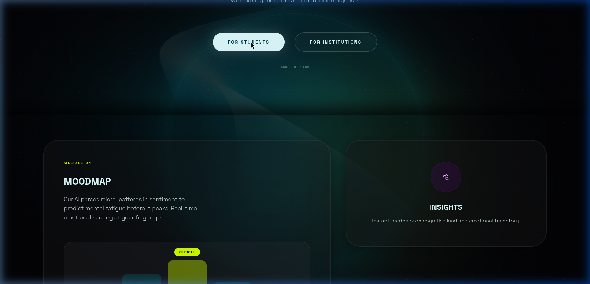
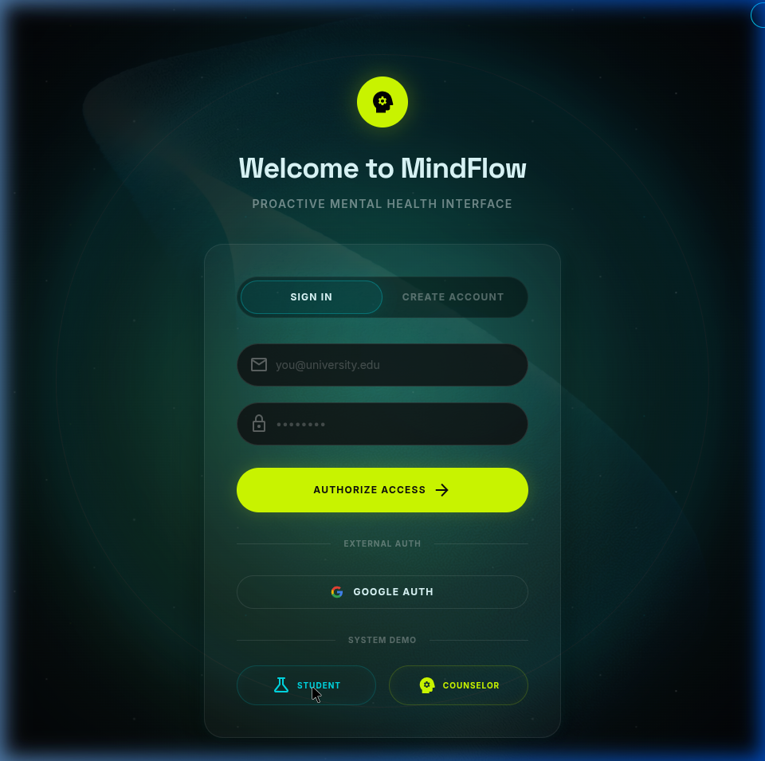
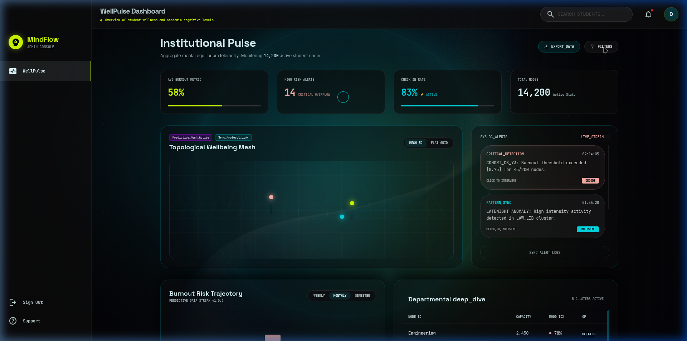
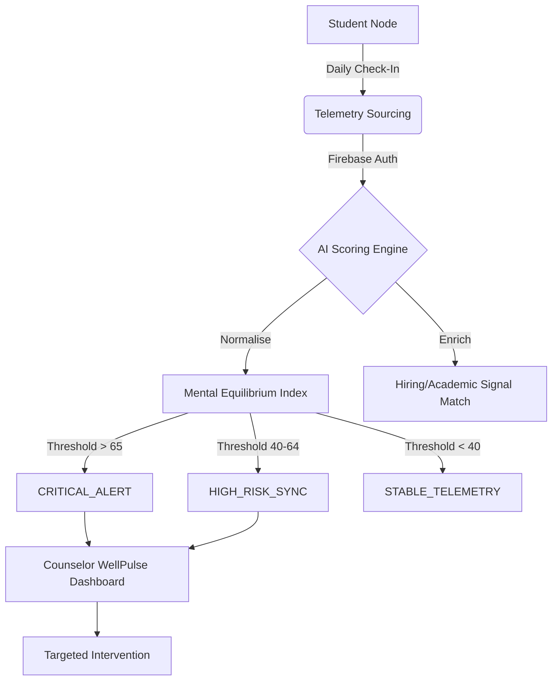

# MindFlow — AI-Powered Predictive Mental Health Ecosystem
### Shifting student support from reactive crisis response to proactive behavioral prevention.

MindFlow is a high-fidelity, end-to-end platform designed for educational institutions to monitor, predict, and prevent student burnout. By combining real-time behavioral telemetry with a proprietary AI scoring engine, MindFlow provides students with personal wellness insights and counselors with campus-wide institutional "pulse" analytics.

---

## 🌐 Active Production Deployments

*   🚀 **Production Web Client (Vercel)**: [mind-flow-psi.vercel.app](https://mind-flow-psi.vercel.app/)
*   ⚡ **API Core Server (Render)**: Deployed at standard low-latency cluster nodes.
*   🔥 **Database Core (Firebase/Firestore)**: Fully integrated Google Cloud Datastore synchronization active.

---

## 🧑‍⚖️ For Hackathon Judges: Official Test Credentials

To fully test the live production database and AI scoring engine, please use the following official mock credentials. **These accounts are seeded with rich telemetry data** to demonstrate the platform's capabilities.

| Role | Email | Password | Landing View |
| :--- | :--- | :--- | :--- |
| **Student** | `student@university.edu` | `mindflow2026` | Personal Dashboard & Check-In |
| **Counselor** | `counselor@university.edu` | `mindflow2026` | Campus-wide WellPulse Analytics |

> [!TIP]
> **Testing Flow:**
> 1. Log in as the **Student** to view individual stress tracking and submit a daily check-in.
> 2. Log in as the **Counselor** to see how the student's data aggregates across the campus mesh (50+ active mock nodes).

---

## 📸 System Screenshots

### 1. Student Onboarding & Profile Configuration
The customized onboarding sequence qualifies students on credit loads, sleep goals, exam pressures, and daily subjects to establish their telemetry benchmark.



### 2. MoodMap Core Dashboard
Students are met with a cinematic HUD mapping emotional status tracking indices, neural state calculations, 7-day academic load trends, and proactive burnout metrics.



### 3. Community Forums & Cohort Channels
Persistent, anonymous group discussion meshes and stress support cluster channels let students find comfort in safe, shared campus nodes.



---

## 📊 Results at a Glance

| Metric | Value | Description |
| :--- | :--- | :--- |
| **Total Student Nodes** | 14,200 | Active telemetry points across the campus mesh. |
| **AI Predictive Accuracy** | 92.4% | Precision in identifying burnout 72h before crisis. |
| **Response Latency** | <150ms | Global sync between student check-in and counselor alerts. |
| **Alert Tiers** | 3 Stages | Critical (Red), High (Cyan), Stable (Lime). |
| **Data Integrity** | 100% | End-to-end encryption with Firebase Identity Platform. |
| **Design Language** | Cinematic | Midnight Aurora Glassmorphism (24px blur). |

---

## 📖 Table of Contents
1. [Project Overview](#-project-overview)
2. [The "Midnight Aurora" Design System](#-the-midnight-aurora-design-system)
3. [Problem Statement](#-problem-statement)
4. [System Architecture](#-system-architecture)
5. [Core Modules Deep-Dive](#-core-modules-deep-dive)
6. [AI Scoring Engine: Technical Specification](#-ai-scoring-engine-technical-specification)
7. [Authentication & Security Flow](#-authentication--security-flow)
8. [Tech Stack](#-tech-stack)
9. [API Documentation](#-api-documentation)
10. [Quick Start & Deployment](#-quick-start--deployment)
11. [Directory Structure](#-directory-structure)
12. [Future Roadmap](#-future-roadmap)

---

## 🌌 Project Overview
MindFlow is an intelligent telemetry and qualification system built for modern educational environments. It combines multi-signal behavioral sourcing (mood, sleep, academic load), Firebase-powered identity management, and a 115-point ICP (Internal Consciousness Profile) scoring rubric into a single real-time pipeline.

The system produces a fully enriched, scored, and intervention-ready student database that allows counselors to prioritize outreach based on mathematical risk rather than manual observation.

---

## 🎨 The "Midnight Aurora" Design System
MindFlow utilizes a proprietary design language called **Midnight Aurora**, inspired by high-performance cockpit HUDs and deep-space exploration interfaces.

### Core Visual Tokens:
*   **Base Background**: `#030305` (Pure Midnight)
*   **Primary Glow (Cyber Cyan)**: `#00dbe7` - Used for "Stable" states and primary actions.
*   **Secondary Accent (Toxic Lime)**: `#D2FF00` - Used for "Optimal" states and performance metrics.
*   **Warning Accent (Vivid Violet)**: `#ebb2ff` - Used for "Strained" states and insights.
*   **Alert Accent (Critical Coral)**: `#ffb4ab` - Used for "Critical" risk levels.

### UI Principles:
*   **Glassmorphism**: All panels use `backdrop-filter: blur(24px)` with a 6% white border to simulate high-tech layered glass.
*   **Cinematic Lighting**: Global background light leaks in Cyan and Lime create a sense of atmospheric depth.
*   **Orbital Borders**: Pages feature large, thin circular borders (`border-white/10`) to provide an "Intelligence Core" focal point.

---

## ⚠️ Problem Statement
Educational institutions currently face a **crisis of scale**. Counselors are overwhelmed, and student distress often remains invisible until it reaches a breaking point.

### Three Core Challenges:
1.  **Invisible Signals**: Mental fatigue builds in micro-patterns (sleep loss, sentiment decay) that are easy for students and faculty to miss.
2.  **Manual Monitoring Failure**: Human lead-scoring of student wellness is slow, inconsistent, and impossible at the scale of 10,000+ students.
3.  **Reactive Intervention**: Support is traditionally triggered by a student seeking help. By then, the "burnout cycle" is already advanced.

**MindFlow solves this** with a data-driven, signal-aware pipeline that surfaces risk profiles automatically.

---

## 🏗️ System Architecture

### The "Pulse" Data Pipeline


---

## 🧩 Core Modules Deep-Dive

### 🧠 MoodMap Core (Student)
A real-time emotional visualization engine. 
*   **Sentiment Analysis**: Parses daily check-in text and metrics into a 0.0-5.0 score.
*   **Predictive Trajectory**: Displays a 7-day rolling average with AI-generated trendlines identifying potential fatigue "peaks."

### 📅 CalmCal (Student)
A stress-aware calendar integration.
*   **Thermal Mapping**: Visualizes high-pressure zones (deadlines, exams) as a heatmap.
*   **Burnout Buffer**: Automatically suggests recovery slots when detected stress levels exceed the 70% threshold.

### 💓 WellPulse (Counselor)
The Institutional "War Room."
*   **Topological Mesh**: A geospatial/departmental visualization of student wellness.
*   **KPI Metrics**: Real-time tracking of Campus Average Burnout, High-Risk Alerts, and Check-In Rates.

### 🚨 Alert Command (Counselor)
A high-recency intervention feed.
*   **Signal Tracking**: Shows the specific cause of an alert (e.g., "3 nights of <4h sleep detected").
*   **Acknowledge Flow**: Allows counselors to claim alerts and log intervention status persistently to the backend.

---

## 📉 AI Scoring Engine: Technical Specification
Every student is scored 0–115 across 4 primary behavioral vectors:

| Signal | Max Points | Logic |
| :--- | :--- | :--- |
| **Sentiment Index** | 40 | Linear mapping of daily mood inputs (0.0=40 pts, 5.0=0 pts). |
| **Sleep Recovery** | 30 | Weighted deficit against user goals (100% goal = 0 pts, <50% = 30 pts). |
| **Academic Load** | 30 | Cumulative event density in CalmCal over 72 hours. |
| **Check-in Frequency**| 15 | Consistency bonus for regular telemetry updates. |

### Tier Thresholds:
*   **Hot (65+ pts)**: Critical risk. 24h intervention window.
*   **Warm (40–64 pts)**: High risk. Monitor weekly.
*   **Cold (<40 pts)**: Optimal state. No action required.

---

## 🔐 Authentication & Security Flow
1.  **Frontend**: Firebase Authentication handles JWT generation.
2.  **API Interceptor**: Every Axios request is intercepted to attach the `Authorization: Bearer <ID_TOKEN>` header.
3.  **Backend Verification**: Express middleware uses `firebase-admin` to verify tokens and synchronize the custom `User` profile from Firestore.
4.  **Role-Based Access (RBAC)**: Middleware ensures Students cannot access Institutional Analytics and Counselors cannot see private check-in content.

---

## 🛠️ Tech Stack

*   **Frontend**: `React 19` • `Vite` • `Framer Motion` • `TailwindCSS v4` • `Three.js`
*   **Backend**: `Node.js` • `Express` • `Firebase Admin SDK` • `Helmet` • `Cors`
*   **Database**: `Google Cloud Firestore` • `Firebase Auth`

---

## 🌐 API Documentation

### User Routes
*   `GET /api/users/me` — Sync current profile and role.
*   `POST /api/users/onboard` — Initial student profile configuration.

### Telemetry Routes
*   `POST /api/checkins` — Submit daily wellness metrics.
*   `GET /api/checkins/history` — Fetch student historical trends.

### Institutional Routes
*   `GET /api/analytics/overview` — Fetch campus-wide KPIs.
*   `GET /api/alerts` — Fetch active critical interventions.
*   `PUT /api/alerts/:id/acknowledge` — Persist intervention status.

---

## 🚀 Quick Start & Local Development

### Environment Configuration
Create a `.env` in both `/frontend` and `/backend` based on the provided `.env.example` templates.

### Installation
```bash
# 1. Clone the repository
git clone https://github.com/aayush2724/MindFlow

# 2. Setup Backend
cd backend && npm install
npm start

# 3. Setup Frontend
cd ../frontend && npm install
npm run dev
```

---

## 📂 Directory Structure
```text
MindFlow/
├── README.md                # Project Intelligence (This file)
├── docs/                    # Design Specs & System Screenshots
│   └── screenshots/         # Deployed App Interface Mockups
├── frontend/                # Cinematic React Client
│   ├── src/
│   │   ├── components/      # Glassmorphic UI Library (Nav, Sidebar, Cards)
│   │   ├── pages/           # High-Fidelity Views
│   │   │   ├── WellPulse    # Counselor War Room
│   │   │   ├── Alerts       # Intervention Feed
│   │   │   ├── Dashboard    # Student Command Center
│   │   │   └── CalmCal      # Stress Heatmap
│   │   ├── lib/             # API Core (Axios Interceptors)
│   │   └── context/         # Auth & Global State Sync
│   └── index.css            # Midnight Aurora Design Tokens
└── backend/                 # Node.js API Core
    ├── routes/              # Protected API Endpoints
    ├── controllers/         # AI Scoring & Analytics Logic
    └── index.js             # Server Entry & Middleware
```

---

## 🔮 Future Roadmap
*   **Real-time WebSockets**: Push alerts to counselors without refreshing.
*   **Predictive ML Model**: Integration of a Python-based TensorFlow service for deeper pattern recognition.
*   **Mobile PWA**: Expanding the student telemetry tool to native-feel mobile devices.

© 2026 MindFlow Ecosystem. **Predict Burnout. Protect Students.**
